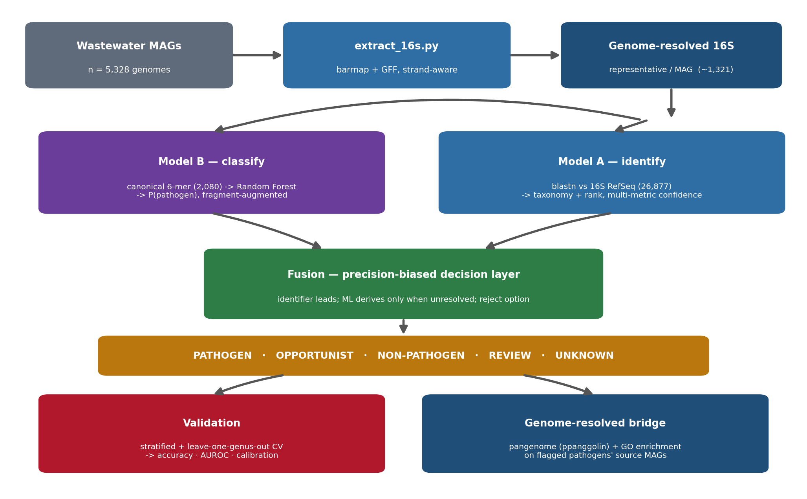

# Wastewater 16S Pathogenicity Prediction System

A machine-learning pipeline that predicts bacterial pathogenicity **from a single 16S
rRNA gene**, keeping every call linked to its source genome. It is the 16S track of the
GOMICS framework and mirrors the whole-genome project
[`bicbioeng/wastewater-mag-pathogenicity-prediction`](https://github.com/bicbioeng/wastewater-mag-pathogenicity-prediction),
adapting each step from the 705-dimensional gene-family feature space to the single-gene
16S setting, and adding a **genome-resolved bridge** (pangenome + GO enrichment) on the
organisms it flags.

---

## Table of Contents

- [Overview](#overview)
- [Methodology](#methodology)
- [Pipeline at a Glance](#pipeline-at-a-glance)
- [Project Structure](#project-structure)
- [Requirements](#requirements)
- [Installation](#installation)
- [Step-by-Step Workflow](#step-by-step-workflow)
  - [Step 1 — Build the Model A reference](#step-1--build-the-model-a-reference)
  - [Step 2 — Build the Model B labeled set](#step-2--build-the-model-b-labeled-set)
  - [Step 3 — Train Model B](#step-3--train-model-b)
  - [Step 4 — Extract genome-resolved 16S from MAGs](#step-4--extract-genome-resolved-16s-from-mags)
  - [Step 5 — Run predictions](#step-5--run-predictions)
  - [Step 6 — Validate the model against ground truth](#step-6--validate-the-model-against-ground-truth)
  - [Step 7 — Feature importance + genome-resolved bridge](#step-7--feature-importance--genome-resolved-bridge)
- [Prediction Modes](#prediction-modes)
- [Output Files](#output-files)
- [Configuration](#configuration)
- [Saved Model Directory](#saved-model-directory)
- [Notebook](#notebook)

---

## Overview

This project predicts whether a bacterial **16S rRNA gene** comes from a pathogenic or
non-pathogenic organism, and — because each 16S sequence is extracted from a
reconstructed genome (MAG) — traces every pathogenicity call back to the genome that
produced it. Unlike a standard 16S amplicon survey, whose reads are genome-anonymous,
this pipeline is *genome-resolved*: a flagged organism can be followed directly into its
source MAG for virulence and resistance gene content.

The whole-genome GOMICS classifier operates on a 705-dimensional gene-family
presence/absence vector, which is the zero vector for a single 16S gene. Rather than
retrain that model, this project **reuses the same labeled genome collection but changes
the feature representation**, yielding a dedicated two-model 16S method.

---

## Methodology

### A two-model ensemble

| Model | Question | Method |
|-------|----------|--------|
| **Model A — identify** | *Which organism is this?* | Instance-based nearest-neighbour. `blastn` against a **26,877-sequence** NCBI 16S RefSeq (Targeted Loci) reference → taxonomy + rank (species ≥ 99% id, genus ≥ 97%). Multi-metric confidence (identity × alignment length × coverage × abundance) down-ranks spurious hits to `unknown`. |
| **Model B — classify** | *Is it pathogenic?* | Parametric. Each sequence → **2,080-dim canonical 6-mer** frequency vector `(4^k + 4^(k/2))/2` → class-balanced **Random Forest** → `P(pathogen)`. Trained on **1,432** pathogenicity-labeled 16S genes (**826 pathogen + 606 non-pathogen**) pulled from the same genomes as the whole-genome model, with **fragment augmentation** for short-read robustness. |
| **Fusion — decide** | *One honest call* | Precision-biased rule layer. The high-precision identifier leads when confident; Model B only *derives* a call when identity cannot resolve the input. A **reject option** emits `UNKNOWN` below a confidence floor. Output tiers: `PATHOGEN`, `OPPORTUNIST`, `NON-PATHOGEN`, `REVIEW`, `UNKNOWN`. |

The **26,877** taxonomy-labeled references (Model A) and the **1,432**
pathogenicity-labeled genes (Model B) are distinct resources for distinct jobs and are
never conflated.

### Genome-resolved bridge (downstream)

For taxa flagged `PATHOGEN` / `OPPORTUNIST`, the pipeline reconnects to genomes and runs
the *same* downstream as the MAG repo — a `ppanggolin` pangenome and GO-term enrichment —
on the flagged organisms' **source MAGs**, recovering the gene families and pathways
behind each call.

### Validation against ground truth

Model B accuracy is measured on its 1,432 labeled genes with `validate_16s_model.py`:

- **Stratified k-fold CV** — in-distribution performance.
- **Leave-one-genus-out CV** — every test genus is removed from training, isolating
  generalization from the Model A lookup. **This is the number reported as the model's
  accuracy.**
- Metrics: accuracy, balanced accuracy, sensitivity, specificity, precision, F1, MCC,
  AUROC, AUPRC, plus a calibration curve + Brier score.

> A 15-sequence logic panel scores 100% sensitivity/specificity, but every panel pathogen
> belongs to a genus already in the Model A reference, so it validates pipeline *logic and
> precision*, not generalization. Cite the leave-one-genus-out numbers for generalization.

---

## Pipeline at a Glance



Genome-resolved 16S rRNA genes are extracted from every wastewater MAG
(`extract_16s.py`), then scored by a two-model ensemble: **Model A** identifies the
organism by nearest-neighbour BLAST against a 26,877-sequence 16S reference, and
**Model B** classifies pathogenicity from the sequence's canonical 6-mer composition
with a Random Forest. A **precision-biased fusion layer** combines them into one of
five tiers (`PATHOGEN`, `OPPORTUNIST`, `NON-PATHOGEN`, `REVIEW`, `UNKNOWN`), with the
high-precision identifier leading and the classifier deriving a call only when
identity cannot resolve the input. Two downstream branches close the loop:
**validation** measures the classifier's accuracy (stratified + leave-one-genus-out
cross-validation), and the **genome-resolved bridge** runs a pangenome + GO
enrichment on the source MAGs of every flagged pathogen.

<details>
<summary>Text-only version (for terminals)</summary>

```
5,328 wastewater MAGs
      |  barrnap + GFF  (extract_16s.py)
      v
genome-resolved representative 16S  (~1,321, one per MAG)
      |
      +-- Model A: blastn vs 16S RefSeq (26,877) --> taxonomy + rank
      +-- Model B: canonical 6-mer (2,080) --> Random Forest --> P(pathogen)
                         |
                         v
        precision-biased fusion (+ reject option)
                         |
     PATHOGEN . OPPORTUNIST . NON-PATHOGEN . REVIEW . UNKNOWN
                         |
      +------------------+-------------------+
   validation (CV + leave-genus-out)   genome-resolved bridge
   -> accuracy / AUROC / calibration   -> pangenome + GO enrichment
```

</details>

---

## Project Structure

```
wastewater-16s-pathogenicity-prediction/
│
├── README.md
├── .gitignore
├── wastewater_16s_pathogenicity_prediction.ipynb   Objective-per-cell runnable notebook
│
│── 16S data & reference
├── ref_16s_download.py                 Download NCBI 16S RefSeq (Targeted Loci) reference (Model A)
├── labeled_16s_build.py                Extract labeled 16S genes from source genomes (Model B, 826 + 606)
│
│── Genome list inputs (reused from the MAG project)
├── pathogen_complete_genomes_fixed.json
├── non_pathogen_complete_genomes_fixed.json
├── complete_pathogen_genome_only.json
│
│── Model A reference build
├── build_16s_blast_db.py               makeblastdb over the 16S reference
│
│── 16S extraction (wastewater application)
├── extract_16s.py                      barrnap + GFF → genome-resolved representative 16S
│
│── Model B training + inference
├── train_16s_model.py                  canonical k-mer featurization + Random Forest (+augmentation)
├── pathogen_predict.py                 Unified inference tool — `16s` subcommand (Model A + B + fusion)
├── validate_16s_model.py               Ground-truth validation harness (CV + leave-one-genus-out)
│
│── Feature importance + genome-resolved bridge
├── kmer_feature_importance_16s.py      Top canonical k-mers driving Model B
├── feature_importance_genes_go.py      (reused) pangenome feature → gene → GO on flagged genomes
├── go_pathway_prediction.py            (reused) GO enrichment → pathway summary + plots
│
│── Saved artifacts (committed — needed for inference)
└── saved_model_16s/
    ├── kmer16s_model.pkl               Trained Random Forest (Model B)
    ├── kmer_index.json                 Ordered canonical k-mer feature list (2,080)
    ├── pathogen_16s_catalog.json       Curated pathogen/opportunist catalog (fusion)
    ├── labeled_16s.fasta               826 pathogen + 606 non-pathogen genes (Model B training)
    └── ref_16s/                        Model A BLAST reference DB (16S RefSeq, ~26,877)
```

---

## Requirements

### Python (≥ 3.10)

```
pandas
numpy
scikit-learn
matplotlib
seaborn
scipy               # Fisher's exact test in go_pathway_prediction.py
statsmodels         # Benjamini-Hochberg correction
goatools            # GO OBO parsing
requests            # NCBI Datasets API + QuickGO REST
tqdm
biopython           # GBFF parsing for GO term extraction
nbformat            # notebook
```

### Bioinformatics tools

| Tool | Purpose | Conda install |
|------|---------|---------------|
| `blast+` | Model A nearest-neighbour identification; reference DB | `conda install -c bioconda blast` |
| `barrnap` | 16S rRNA gene prediction in genomes/MAGs | `conda install -c bioconda barrnap` |
| `ppanggolin` | Pangenome of flagged genomes (genome-resolved bridge) | `conda install -c bioconda ppanggolin` |
| `mafft` | Multiple alignment for the 16S phylogeny | `conda install -c bioconda mafft` |
| `fasttree` | 16S phylogeny | `conda install -c bioconda fasttree` |
| `wget` | Reference download | system or `conda install wget` |

> `blast+` and `barrnap` are the only tools required for the core 16S workflow.
> `ppanggolin`, `mafft`, and `fasttree` are used only by the downstream phylogeny and the
> genome-resolved bridge.

---

## Installation

```bash
# 1. Clone or copy the project
git clone <your-repo-url>
cd wastewater-16s-pathogenicity-prediction

# 2. Create a conda environment
conda create -n gomics_16s python=3.11
conda activate gomics_16s

# 3. Install Python packages
pip install pandas numpy scikit-learn matplotlib seaborn scipy statsmodels \
            goatools requests tqdm biopython nbformat

# 4. Install bioinformatics tools
conda install -c bioconda blast barrnap ppanggolin mafft fasttree wget
```

---

## Step-by-Step Workflow

Run the notebook `wastewater_16s_pathogenicity_prediction.ipynb` top-to-bottom, or the
scripts below. Each objective is one notebook cell.

### Step 1 — Build the Model A reference

Download the NCBI 16S RefSeq (Targeted Loci) BLAST database (~26,877 sequences):

```bash
python ref_16s_download.py            # or: build_16s_blast_db.py for a custom FASTA
```

Produces `saved_model_16s/ref_16s/` (the Model A nearest-neighbour reference).

### Step 2 — Build the Model B labeled set

Extract the longest 16S gene from each labeled source genome (pathogen / non-pathogen)
and tag headers with `label` and `genus`:

```bash
python labeled_16s_build.py
```

Produces `saved_model_16s/labeled_16s.fasta` (826 pathogen + 606 non-pathogen).

### Step 3 — Train Model B

Featurize each labeled gene as a 2,080-dim canonical 6-mer vector (with fragment
augmentation) and train the class-balanced Random Forest:

```bash
python train_16s_model.py --kmer-k 6
```

Produces `saved_model_16s/kmer16s_model.pkl` and `kmer_index.json`.

### Step 4 — Extract genome-resolved 16S from MAGs

Run `barrnap` over the wastewater MAG catalog and keep one representative 16S per MAG:

```bash
MAGS=/path/to/mags_input OUT16S=/path/to/05_16s_from_mags python extract_16s.py
```

Produces `all_16s.fna` (one `>{accession}__16S` per MAG; ≈1,321 of 5,328 = 24.8%).

### Step 5 — Run predictions

```bash
python pathogen_predict.py 16s --input all_16s.fna --output 06_16s_pathogen_calls
```

Produces `*_16s_taxa.csv` (per-taxon calls) and `*_16s_report.json`.

### Step 6 — Validate the model against ground truth

```bash
python validate_16s_model.py --labeled-fasta saved_model_16s/labeled_16s.fasta \
       --kmer-k 6 --folds 5 --augment 3 --outdir model_b_validation
cat model_b_validation/metrics_summary.json
```

Produces the confusion matrix, sensitivity/specificity, precision/recall, F1, MCC,
AUROC/AUPRC and calibration under **stratified** and **leave-one-genus-out** CV. Report
the leave-one-genus-out numbers as the model's accuracy.

### Step 7 — Feature importance + genome-resolved bridge

k-mer importance (which 6-mers drive Model B):

```bash
python kmer_feature_importance_16s.py
```

Genome-resolved bridge — pangenome + GO enrichment on flagged organisms' source MAGs
(reuses the MAG repo scripts; set their `CONFIG` paths to the bridge directory):

```bash
python feature_importance_genes_go.py     # top gene families → genes → GO terms
python go_pathway_prediction.py           # Fisher enrichment + FDR → pathway summary + plots
```

---

## Prediction Modes

`pathogen_predict.py` mirrors the whole-genome tool's interface and adds a `16s` mode:

| Mode | Input | Description |
|------|-------|-------------|
| `16s` | 16S FASTA (one or many sequences) | Model A + Model B + fusion → per-taxon pathogenicity calls |
| `setup` | — | Build Model A reference + train Model B |

Whole-genome modes (`genome`, `contigs`, `reads`) remain available from the MAG project
and are unchanged; the 16S mode ships as an additional subcommand of the same binary.

---

## Output Files

```
06_16s_pathogen_calls/
├── all_16s_16s_taxa.csv          Per-taxon calls: organism, rank, identity, coverage,
│                                 ml_pathogen_prob, final_call, confidence, evidence
└── all_16s_16s_report.json       Full per-sequence records + community summary

model_b_validation/
├── metrics_summary.json          Headline accuracy (stratified + leave-one-genus-out)
├── cv_stratified_folds.csv       Per-fold metrics
├── cv_leave_genus_out.csv        Per-held-out-genus metrics
├── fig_roc.png                   ROC curves
├── fig_confusion.png             Confusion matrices
└── fig_calibration.png           Reliability curve + Brier score

16s_pipeline_outputs/
├── top_kmers_model_b.csv/.png    k-mer feature importance
├── top_genera.png                Community composition
├── rep16s.nwk                    16S phylogeny (MAFFT + FastTree)
└── genome_resolved_bridge/       Pangenome + GO enrichment on flagged pathogens
```

---

## Configuration

All paths are set at the top of the notebook (Objective 0) via `ROOT` and `DATASETS`, and
via CLI flags for the scripts:

| Flag / variable | Meaning | Default |
|-----------------|---------|---------|
| `--kmer-k` | k-mer size (canonical) | `6` (→ 2,080 features) |
| `--folds` | stratified CV folds | `5` |
| `--augment` | fragments per training sequence | `3` |
| `--threshold` | P(pathogen) decision threshold | `0.5` (uncalibrated; tune) |
| `MIN_LEN` | minimum 16S length (bp) | `400` |
| `THREADS` | worker threads | `8` |

---

## Saved Model Directory

`saved_model_16s/` contains everything needed for inference without retraining:

| File | Contents |
|------|----------|
| `kmer16s_model.pkl` | Trained Random Forest (Model B) |
| `kmer_index.json` | Ordered canonical k-mer feature list (2,080) |
| `pathogen_16s_catalog.json` | Curated pathogen/opportunist catalog used by the fusion layer |
| `labeled_16s.fasta` | 826 pathogen + 606 non-pathogen genes (Model B training / validation) |
| `ref_16s/` | Model A BLAST reference DB (16S RefSeq, ~26,877 sequences) |

---

## Notebook

`wastewater_16s_pathogenicity_prediction.ipynb` runs the whole pipeline with one cell per
objective (0–10), designed for HPC. Objective 6 produces the paper's accuracy table;
Objective 9 produces the genome-resolved pangenome + GO enrichment on flagged pathogens.
